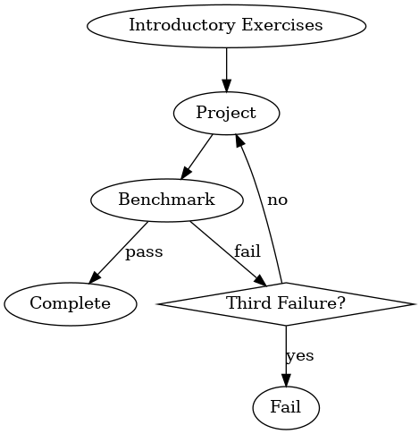

## BCCA Module Workflow

For this benchmark, you are going to implement a class that models a student's progress inside the paced module structure described and diagrammed below.

- A student starts off doing introductory exercises.
- After they complete the introductory exercises, they move on to a project.
- Once they project is completed, they can take a benchmark.
- If they pass a benchmark, they have completed the module.
- If they fail a benchmark, they go back to the project step of the workflow.
- If they fail a benchmark a third time, they fail the module.

Your job is to create a Java class named `ModuleWorkflow` that models this workflow. T

Each of the rubric points will be checked.

## Rubric

- [ ] Starts off with introductory exercises
- [ ] Moves on to a project after introductory exercises
- [ ] Moves on to a benchmark after the student completes a project
- [ ] Is completed if the student passes the benchmark
- [ ] Moves to another project if the student fails the benchmark
- [ ] Fails after 3 benchmark failures
- [ ] Has a record of everything that has happened so far
- [ ] Remembers if work was completed out of order
